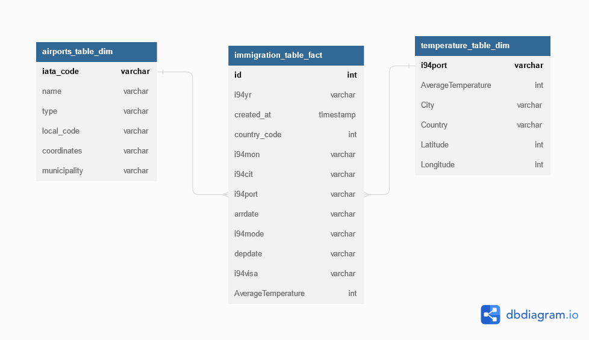

<h1>Data Engineering Capstone Project</h1>

<h3>Introduction</h3>
The purpose of the data engineering capstone project is to create a database schema and ETL pipeline for analyzing immigration data in the United States. We will use three datasets (immigration data, city temperature data and airports data) and create a database that will optimize to query and analyze immigration events. 

<h3>Project Description</h3>
In this project, we apply data modeling and build an ETL pipeline using Python and Spark. We will need to define fact and dimension tables for a star schema for a particular analytic focus, and write an ETL pipeline that transfers data from files in local directories into these tables using Python, Spark and SQL.

<h3>US I94 immigration Dataset</h3>
The first dataset comes from the US National Tourism and Trade Office.  

<h3>Temperature Dataset</h3>
The second dataset consists came from Kaggle and contains monthly average temperature data at different country in the world wide.

<h3>Schema for Immigration Data Analysis</h3>
Using the US I94 immigration and Temperature datasets, we need to create a star schema optimized for queries on Immigration data analysis. This includes the following tables.
<h5>Fact Table</h5>
<h3>Schema for Immigration Data Analysis</h3>

<h3>Project files</h3>
<ol>
  
  <li>immigration_data_sample.csv contains immigration data.</li>
  <li>airport_codes_csv.csv data contains information about different airports around the world. </li>
  <li>us-cities-demographics.csv his contains information about the demographics of all US cities</li>
  <li>I94_port.txt file contains the descriptions for the I94 data</li>
  <li>GlobalLandTemperaturesByMajorCity.csv contains monthly average temperature data at different cities and countries in the world wide </li>
  <li>Capstone Project Template.ipynb contains all steps of the project.</li>
  <li>README.md provides an introduction on the project.</li>
</ol> 

<h3>Project Steps</h3>
Below are steps that we follow to realize the project:
<ol>
  <li>Step 1: Scope the Project and Gather Data  
  This project will integrate I94 immigration data and world temperature data to setup a data warehouse with fact and dimension tables.
  </li>
  <li>Step 2: Explore and Assess the Data  
  We will explore the data to identify data quality issues, like missing values, duplicate data, etc.</li>
  <li>Step 3: Define the Data Model  
  We will show  the conceptual data model and the data pipeline process.</li>
  <li>Step 4: Run ETL to Model the Data 
  In this step, we will create the data pipelines and the data model.  
  We will also run data quality checks to ensure the pipeline ran as expected </li>
  <li>Step 5: Complete Project Write Up 
    We will include a description of how we would approach the problem differently under the following scenarios:  
    1. If the data was increased by 100x. 
    2. If the pipelines were run on a daily basis by 7am. 
    3. If the database needed to be accessed by 100+ people.
  </li>
</ol> 

